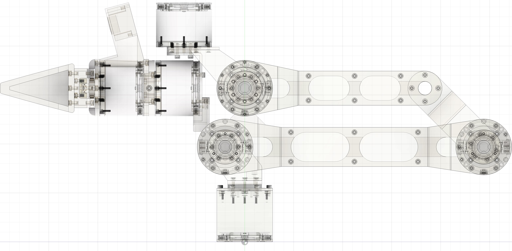

<p align="center">
    
</p>
<p align="center">
    <a href="https://discord.gg/PTZ3CN5WkJ">
        </a>
</p>

# TRLC-DK1
Open Source **D**evelopment **K**it for AI-native Robotics by The Robot Learning Company.


## Demo
<p align="center">
    
</p>

## Examples
```bash
lerobot-teleoperate \
    --robot.type=dk1_follower \
    --robot.port=/dev/tty.usbmodem00000000050C1 \
    --robot.joint_velocity_scaling=1.0 \
    --robot.cameras="{ wrist: {type: opencv, index_or_path: 0, width: 640, height: 360, fps: 30}}" \
    --teleop.type=dk1_leader \
    --teleop.port=/dev/tty.usbmodem58FA0824311 \
    --display_data=true
```
```
lerobot-teleoperate \
    --robot.type=dk1_follower \
    --robot.port=/dev/tty.usbmodem00000000050C1 \
    --robot.joint_velocity_scaling=1.0 \
    --teleop.type=dk1_leader \
    --teleop.port=/dev/tty.usbmodem58FA0824311 \
```